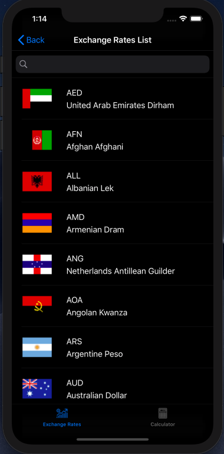

# Currency Converter
## A small and simple exchange rates and currency converter for iOS built using Objective-C

### Features

### 168 currencies updated each 30 minutes

### Fluctuation and variation for each currency considering the day before

### Full functioning currency converter to fast convert into any world's currency (including Bitcoin)

